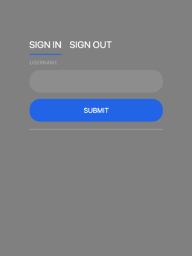

# BarberStop

### Overview

A scheduling app for barbershops that aims to predict average haircut durations for general hairstyles. The app logs the time the user is in the shop by having them check in and out at the entrance using an electronic tablet. Customers sign in and out with their username here:

The estimated time it takes to cut a specific hairstyle is calculated by averaging the completion time of all users with the same haircut and updated on the website for customers to see.

### Features

On our website, the login system utilizes express-sessions and automatically detects the user's status (i.e. admin or customer) to route them accordingly. Barbers have the ability to view their appointment schedules and set their days off. Customers are able to view available appointments, and the website allows them to secure the spot only if the time it takes to complete the requested haircut style fits into an open timeslot.

Other tecnologies utilized in this application include:  

## License & copyright
* Ana Arakaki
* Bianca Jaquez
* Johnn Santos
* Vernie Dela Cruz  
©2018